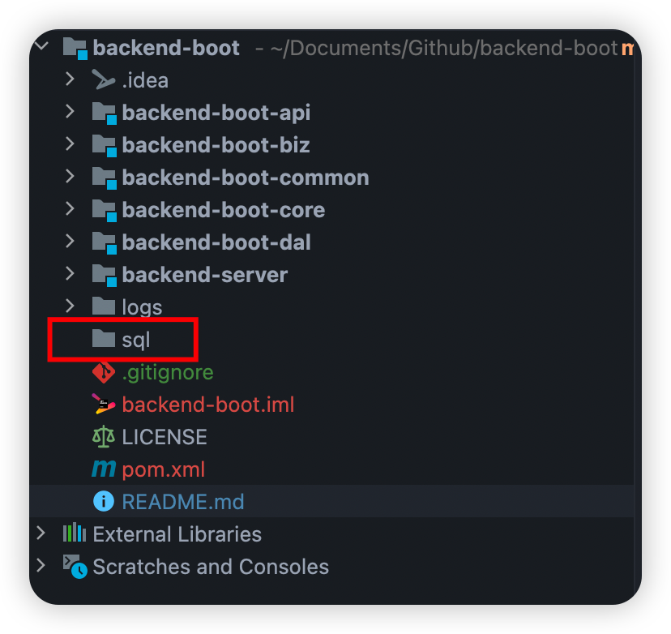
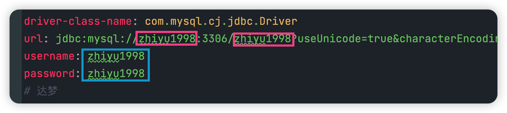
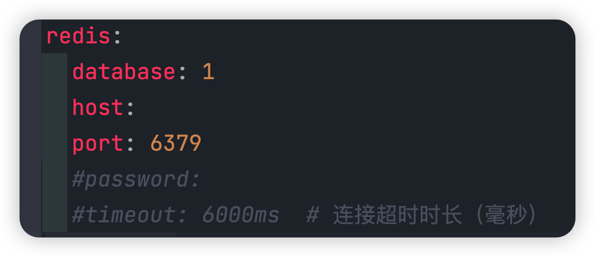
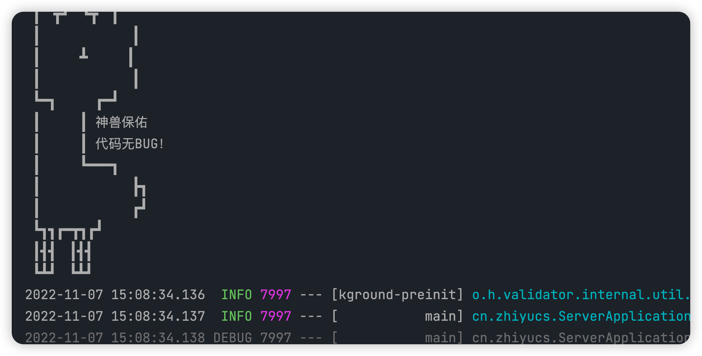

# BACKEND-BOOT 使用说明

👨‍🚀该框架融合了最新脚手架的特点，主要用于快速开发

🚀 Cloud版本：正在搭建

## Maven顺序

请遵守该maven顺序，否则改动后启动不起来

1. core 系统层面，分离业务
2. server 启动
3. common 公共类
4. ...

(备注：因为Spring Security依赖一些Impl，所以要先加载core)

## 技术栈

| 技术        | 版本号      | 说明                |
| ----------- | ----------- | ------------------- |
| Java        | 11          | 主要11特性比8好一些 |
| SpringBoot  | 2.7.4       | Web                 |
| Security    |             | 安全                |
| Redis       |             | 内存缓存            |
| mybatisplus | 3.5.2       | 快速SQL             |
| knife4j     | 3.0.3       | 文档                |
| hutool      | 5.8.8       | 工具                |
| guava       | 31.1-jre    | 工具                |
| mapstruct   | 1.5.2.Final | 实体类转换          |

## 目录说明

* api 接口层
* web 控制层
* biz 业务层
* common 工具类和配置
* core 核心内容/扩展内容
* dal 持久层
* server 启动

## 实用方法

1. 载入数据库内容（`sql`文件夹中）

2. 更改数据库连接、名称、密码

3. 更改redis地址

4. 启动项目

